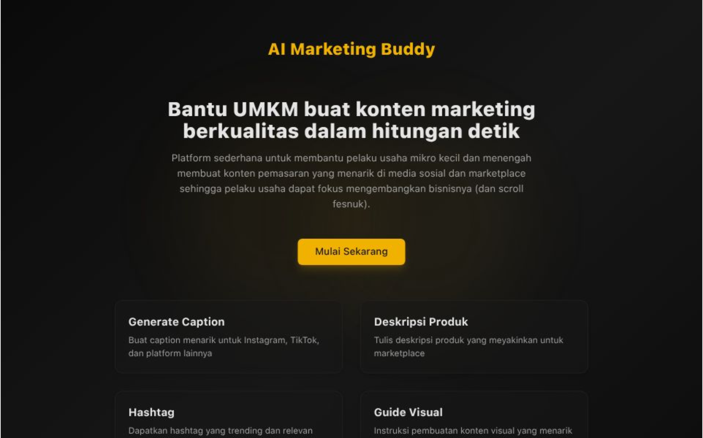
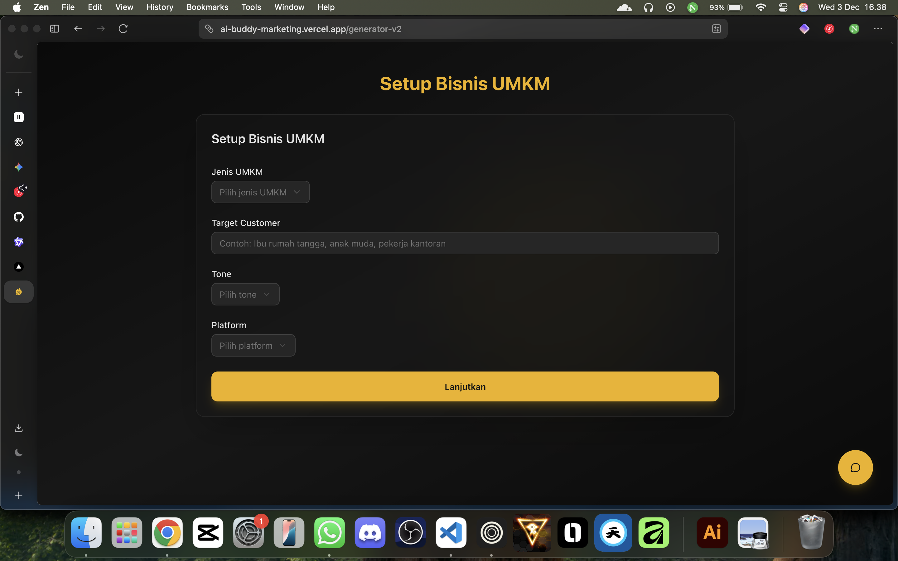
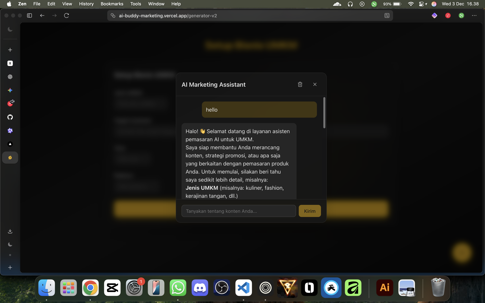

# AI Marketing Buddy for UMKM



A web application designed to help Indonesian UMKM (Usaha Mikro, Kecil, dan Menengah) generate high-quality marketing content using AI.

## 🎯 Problem

Many Indonesian UMKM struggle with creating engaging and effective marketing content for social media (Instagram, WhatsApp) and marketplaces. They often lack the time, resources, or expertise to develop compelling captions, descriptions, hashtags, or visual content strategies.

## 💡 Solution

AI Marketing Buddy provides a simple, intuitive platform where UMKM owners can:

1.  **Setup Business Info:** Quickly input key details like UMKM type, target customer, desired tone, and platform.
2.  **Generate Content:** Instantly generate multiple versions of:
    *   Instagram captions
    *   Relevant hashtags
    *   Marketplace product descriptions
    *   Marketing angle suggestions
    *   **NEW:** Visual content ideas for Instagram (Pictures/Reels), WhatsApp, and other platforms.
3.  **Refine with AI Chat:** Use an integrated chatbot to ask follow-up questions or request modifications based on the initial setup and generated content.
4.  **Save & Copy:** Easily copy or save generated content snippets for immediate use.

The application leverages AI to automate the content creation process, saving time and effort for busy entrepreneurs. It emphasizes the Indonesian market by supporting local dialect prompts (Jawa) and focusing on relevant platforms.

## 🛠️ Tech Stack

*   **Framework:** [Next.js](https://nextjs.org/) (App Router) - For building the React application with server-side rendering capabilities.
*   **Language:** [TypeScript](https://www.typescriptlang.org/) - For type safety and robust code.
*   **Styling:** [Tailwind CSS](https://tailwindcss.com/) - For rapid, utility-first CSS styling.
*   **UI Components:** [shadcn/ui](https://ui.shadcn.com/) - For accessible and customizable UI components built on Radix UI and Tailwind CSS.
*   **Icons:** [Lucide React](https://lucide.dev/)
*   **AI Integration:** [Cerebras Cloud SDK](https://docs.cerebras.ai/)
*   **Deployment:** [Vercel](https://vercel.com/)

## 🚀 Getting Started (Locally)

### Prerequisites

*   Node.js (v18 or later recommended)
*   A Cerebras API Key (sign up at [Cerebras Cloud](https://cloud.cerebras.ai/)) or any other AI API Key (ex. Gemini, OpenAI, etc)

### Installation

1.  **Clone the repository:**
    ```bash
    git clone <your-repository-url>
    cd ai-marketing-buddy
    ```

2.  **Install dependencies:**
    ```bash
    npm install
    # or
    pnpm install
    ```

3.  **Set up environment variables:**
    *   Create a file named `.env.local` in the root directory of the project.
    *   Add your API keys:
        ```env
        # Get your Cerebras API key from https://cloud.cerebras.ai/
        CEREBRAS_API_KEY=your_actual_cerebras_api_key_here
        ```
    *   **Important:** Do *not* commit `.env.local` to your Git repository. Ensure it's listed in `.gitignore` (it should be by default).

4.  **Run the development server:**
    ```bash
    npm run dev
    # or
    pnpm dev
    ```

5.  **Open your browser:**
    Visit [http://localhost:3000](http://localhost:3000) to see the application.

## 📋 Features

*   **Business Setup:** Capture essential UMKM details (type, target customer, tone, platform).
*   **Content Generation:** Generate multiple versions of:
    *   Instagram captions (text).
    *   Relevant hashtags.
    *   Marketplace product descriptions.
    *   Marketing angle suggestions.
    *   **NEW:** Visual content ideas for Instagram (Pictures/Reels), WhatsApp, and other platforms.
    *   [Future Development] Generate Image for Visual Content
*   **Local Dialect Support:** Option to include suggestions using local Indonesian dialects (Jawa/Sunda).
*   **Contextual AI Chat:** Integrated chatbot allowing users to refine generated content based on the initial context.
*   **Content Management:** Copy and save generated content locally in the browser.
*   **Saved Content View:** Access previously saved generations.
*   **Responsive Design:** Works well on desktop and mobile devices.
*   **Dark Theme UI:** Aesthetic dark theme with golden yellow accents and subtle gradients/decorations.

## 📸 Screenshots


_Landing Page_


_Content Generator Page_


_Generated Content_


_Contextual AI Chat_

## 🤖 How AI Integration Works

The application connects to AI models through various methods:

1.  **Backend API Routes (Cerebras, Gemini):** The application makes API calls to backend routes (e.g., `/api/cerebras`) which then securely call the Cerebras or Gemini API using the respective SDKs and stored API keys. This keeps the keys secure on the server.
2.  **Frontend SDK (Puter.js):** If Puter.js is used, the SDK is loaded directly in the browser. The user authorizes API usage via a popup when the feature is invoked, adhering to the "User-Pays" model.

## 📁 Project Structure
ai-marketing-buddy/
├── .env.local          # Environment variables (not committed)
├── .gitignore
├── next.config.ts      # Next.js configuration
├── postcss.config.js   # PostCSS configuration for Tailwind v4
├── tailwind.config.ts  # Tailwind CSS v4 configuration
├── tsconfig.json       # TypeScript configuration
├── package.json
├── package-lock.json (or pnpm-lock.yaml)
├── src/
│   ├── app/
│   │   ├── api/
│   │   │   └──  cerebras/
│   │   │       └── route.ts  # API route for Cerebras integration
│   │   ├── generate/
│   │   │   └── page.tsx      # Business setup page
│   │   ├── generator/
│   │   │   └── page.tsx      # Content generator page (includes setup and generation logic)
│   │   ├── saved/
│   │   │   └── page.tsx      # Saved content page
│   │   ├── globals.css       # Global Tailwind styles
│   │   ├── layout.tsx        # Root layout
│   │   └── page.tsx          # Landing page
│   ├── components/
│   │   └── ui/               # shadcn/ui components
│   │   └── ChatPopup.tsx     # Chatbot component
│   └── lib/
│       └── formatMarkdown.ts # Utility for formatting AI responses
│       └── utils.ts          # Utility functions (e.g., cn helper)
└── README.md


## 📄 License

This project is licensed under the [MIT License](LICENSE). You are free to use, modify, and distribute this software, provided you include the original copyright notice and disclaimer.

## 🚀 Deployment

This application is designed for deployment on [Vercel](https://vercel.com/). Vercel provides seamless integration with Next.js and is the recommended platform.

### Deploying to Vercel

1.  **Push your code** to a Git repository (e.g., GitHub, GitLab).
2.  Sign up or log in to [Vercel](https://vercel.com/).
3.  Import your project repository into Vercel.
4.  Configure the build settings (usually auto-detected for Next.js).
5.  **Add Environment Variables:** In your Vercel project settings, navigate to "Environment Variables". Add the same variables you defined in `.env.local` (e.g., `CEREBRAS_API_KEY`, `GEMINI_API_KEY`) with their actual values.
6.  Deploy! Vercel will automatically build and deploy your application.

### API Key Storage for Deployment (Vercel)

When you deploy your application to Vercel, you **store your API keys securely within Vercel's environment variable system**. This is done in the project settings on the Vercel dashboard, as described in the "Deploying to Vercel" section above. Vercel handles the security of these variables, ensuring they are not exposed in the client-side code or version control.

**Where to Store API Keys for Deployment:**

*   **✅ Vercel Environment Variables:** This is the standard and secure way when deploying to Vercel. You add the keys in the Vercel dashboard for your project. Your application code reads them using `process.env.CEREBRAS_API_KEY` (or similar) just like it did locally, but now the values come from Vercel's secure environment.# ai-buddy-marketing
